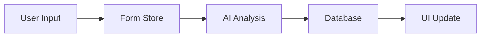
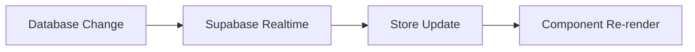

# Free Model Analyzer - Technical Architecture

## System Overview

The Free Model Analyzer is built as a modern web application using React, TypeScript, and Supabase, with AI capabilities powered by OpenAI. The architecture follows a component-based approach with clear separation of concerns and robust state management.

## Technology Stack

### Frontend
- React 18.3.1
- TypeScript 5.5.3
- Vite 5.4.2
- Tailwind CSS 3.4.1
- Zustand (State Management)
- Chart.js (Data Visualization)

### Backend
- Supabase (Database & Authentication)
- PostgreSQL (Database)
- Row Level Security (RLS)

### AI Integration
- OpenAI GPT-4
- VAPI (Voice AI)
- Custom AI Prompts

## Core Architecture Components

### 1. State Management

#### Form Store
```typescript
interface FormStore {
  // Analysis Data
  productDescription: string
  idealUser?: IdealUser
  outcomes: UserOutcome[]
  challenges: Challenge[]
  solutions: Solution[]
  selectedModel: ModelType
  
  // UI State
  currentStep: number
  processingState: Record<string, boolean>
  
  // Analysis Results
  analysis: Analysis | null
}
```

#### Package Store
```typescript
interface PackageStore {
  features: PackageFeature[]
  pricingStrategy: PricingStrategy
  processingState: Record<string, boolean>
}
```

#### Auth Store
```typescript
interface AuthStore {
  user: User | null
  loading: boolean
  error: string | null
  signIn: (email: string, password: string) => Promise<void>
  signOut: () => Promise<void>
}
```

### 2. Component Architecture

#### Multi-Step Form
- Controlled navigation
- State preservation
- Progress tracking
- Validation logic

```typescript
interface Step {
  id: string
  component: React.ComponentType
  isComplete: (state: FormState) => boolean
  isUnlocked: (state: FormState) => boolean
}
```

#### Analysis Components
- DEEP Framework visualization
- Component-specific analysis
- Interactive feedback
- Real-time updates

#### AI Integration Components
- Chat interface
- Voice interaction
- Context management
- Response processing

### 3. Database Schema

#### Analyses Table
```sql
CREATE TABLE analyses (
  id uuid PRIMARY KEY DEFAULT gen_random_uuid(),
  user_id uuid REFERENCES auth.users,
  title text DEFAULT 'Untitled Analysis',
  product_description text NOT NULL,
  ideal_user jsonb,
  outcomes jsonb,
  challenges jsonb,
  solutions jsonb,
  selected_model text,
  features jsonb,
  user_journey jsonb,
  analysis_results jsonb,
  created_at timestamptz DEFAULT now(),
  updated_at timestamptz DEFAULT now(),
  share_id uuid DEFAULT gen_random_uuid(),
  is_public boolean DEFAULT false
);
```

#### Security Policies
```sql
-- Read access
CREATE POLICY "Users can read own analyses" ON analyses
  FOR SELECT USING (auth.uid() = user_id);

-- Create access
CREATE POLICY "Users can create analyses" ON analyses
  FOR INSERT WITH CHECK (auth.uid() = user_id);

-- Update access
CREATE POLICY "Users can update own analyses" ON analyses
  FOR UPDATE USING (auth.uid() = user_id);

-- Share access
CREATE POLICY "Anyone can read public analyses" ON analyses
  FOR SELECT USING (is_public = true);
```

### 4. AI Integration Architecture

#### Analysis Pipeline
1. User input collection
2. Context preparation
3. AI model selection
4. Prompt generation
5. Response processing
6. Result formatting

#### Voice Chat Architecture
1. Speech-to-text conversion
2. Context management
3. AI processing
4. Text-to-speech conversion
5. Real-time streaming

### 5. Authentication Flow

1. User Authentication
```typescript
async function handleAuth() {
  const { user, session } = await supabase.auth.signIn()
  if (session) {
    await setupUserSession(session)
    initializeAnalysis()
  }
}
```

2. Session Management
```typescript
function setupUserSession(session) {
  setAuthToken(session.access_token)
  configureAxios(session.access_token)
  initializeRealtime()
}
```

### 6. Data Flow

#### Analysis Creation


#### Real-time Updates


## Performance Optimization

### 1. Caching Strategy
- React Query for data fetching
- Local storage for form state
- Memory caching for AI responses

### 2. Code Splitting
- Route-based splitting
- Component lazy loading
- Dynamic imports

### 3. Resource Optimization
- Image optimization
- CSS purging
- Bundle size monitoring

## Security Measures

### 1. Authentication
- JWT token management
- Session handling
- Secure cookie storage

### 2. Data Protection
- Row Level Security
- Input sanitization
- XSS prevention

### 3. API Security
- Rate limiting
- Request validation
- Error handling

## Monitoring & Analytics

### 1. Performance Monitoring
- Page load metrics
- API response times
- Error tracking

### 2. User Analytics
- Feature usage
- Conversion rates
- User engagement

### 3. System Health
- Server status
- Database performance
- AI service availability

## Deployment Architecture

### 1. Production Environment
- Netlify hosting
- Supabase backend
- OpenAI integration

### 2. CI/CD Pipeline
- GitHub Actions
- Automated testing
- Deployment checks

### 3. Environment Configuration
- Environment variables
- Feature flags
- Configuration management

## Error Handling

### 1. Global Error Boundary
```typescript
class ErrorBoundary extends React.Component {
  componentDidCatch(error: Error, errorInfo: React.ErrorInfo) {
    logError(error, errorInfo)
    showErrorUI()
  }
}
```

### 2. API Error Handling
```typescript
async function handleAPIRequest() {
  try {
    const response = await api.request()
    return processResponse(response)
  } catch (error) {
    handleError(error)
    showUserFeedback(error)
  }
}
```

## Testing Strategy

### 1. Unit Tests
- Component testing
- Store testing
- Utility testing

### 2. Integration Tests
- Form flow testing
- API integration
- State management

### 3. E2E Tests
- Critical user paths
- Authentication flows
- Analysis completion

## Scalability Considerations

### 1. Database Scaling
- Connection pooling
- Query optimization
- Index management

### 2. API Scaling
- Rate limiting
- Caching
- Load balancing

### 3. Frontend Scaling
- Code splitting
- Performance optimization
- Resource management